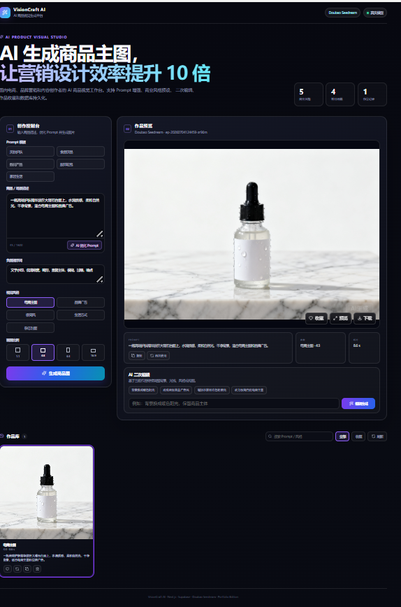
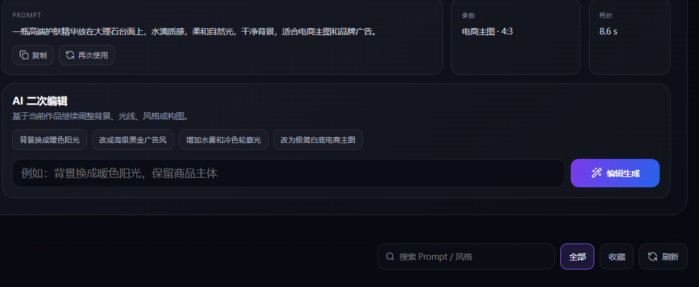
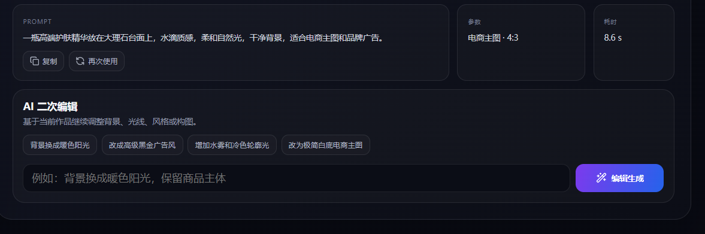
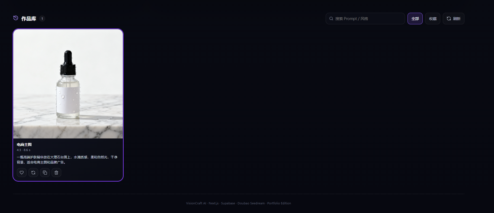
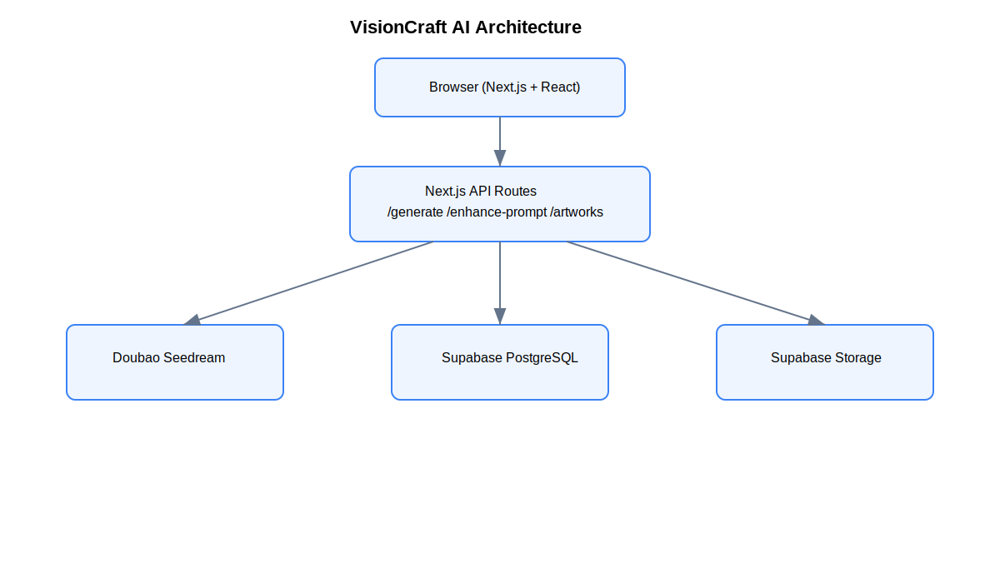
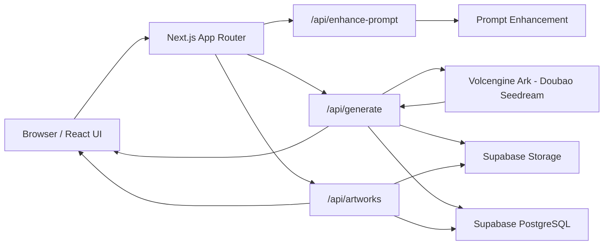
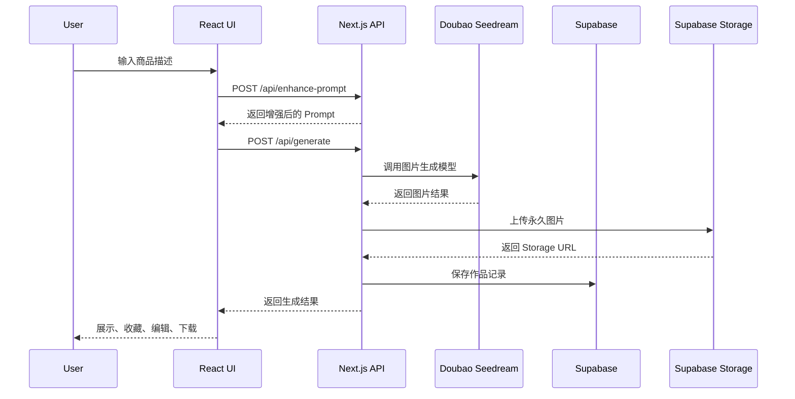

<div align="center">

# VisionCraft AI

### AI 商品视觉生成平台  
### AI Product Visual Generation Platform

基于 **Next.js、TypeScript、Doubao Seedream、Prompt Engineering 与 Supabase** 构建的 AI 商品视觉工作台。

[在线演示](https://your-vercel-domain.vercel.app) ·
[项目架构](docs/architecture.svg) ·
[API 流程](docs/api-flow.svg)

</div>

---

## 项目简介

VisionCraft AI 是一个面向电商、品牌营销和内容创作者的 AI 商品视觉生成平台。

用户可以输入商品或场景描述，选择商业风格与画幅，通过 Prompt 增强后调用火山方舟 Doubao Seedream 模型生成图片，并对作品进行收藏、搜索、二次编辑、下载和持久化管理。

本项目重点不只是调用图片生成 API，而是围绕真实业务场景完成了从 Prompt 输入、模型调用、作品管理到安全部署的一套完整流程。

---

## 核心功能

- **AI 文生图**：根据商品、品牌或场景描述生成商业视觉图片
- **Prompt 增强**：将简短描述优化为适合图片生成模型的高质量提示词
- **AI 二次编辑**：基于已有作品继续调整背景、光线、风格和构图
- **商业风格预设**：电商主图、品牌广告、极简风、生活方式、杂志封面
- **多画幅支持**：1:1、4:3、3:4、16:9
- **作品管理**：历史记录、搜索、收藏、删除、下载和大图预览
- **数据库持久化**：使用 Supabase PostgreSQL 保存作品信息
- **永久图片存储**：生成图片上传至 Supabase Storage，避免临时链接失效
- **Demo 模式**：公开部署时可关闭真实模型调用，防止个人 API 额度被滥用
- **限流保护**：支持单 IP 与全站每日生成次数限制
- **响应式界面**：适配桌面端与移动端

---

## 项目截图

### 1. 首页与创作控制台



### 2. AI 图片生成结果


### 3. Prompt 增强



### 4. AI 二次编辑



### 5. 作品库与收藏管理



---

## 技术栈

| 模块 | 技术 |
|---|---|
| 前端框架 | Next.js App Router |
| 开发语言 | TypeScript |
| UI | React + CSS |
| AI 生图 | 火山方舟 Doubao Seedream |
| Prompt 处理 | Prompt Engineering + Next.js Route Handlers |
| 数据库 | Supabase PostgreSQL |
| 图片存储 | Supabase Storage |
| API 层 | Next.js API Route |
| 状态管理 | React Hooks |
| 版本管理 | Git + GitHub |
| 部署 | Vercel |

---

## 系统架构





---

## 核心流程



---

## 目录结构

```text
visioncraft-ai
├─ app
│  ├─ api
│  │  ├─ artworks
│  │  │  └─ route.ts
│  │  ├─ enhance-prompt
│  │  │  └─ route.ts
│  │  ├─ generate
│  │  │  └─ route.ts
│  │  └─ health
│  │     └─ route.ts
│  ├─ globals.css
│  ├─ layout.tsx
│  └─ page.tsx
├─ components
│  └─ image-workbench.tsx
├─ lib
│  ├─ artwork-storage.ts
│  ├─ demo-image.ts
│  ├─ rate-limit.ts
│  ├─ supabase-server.ts
│  ├─ supabase.ts
│  ├─ types.ts
│  └─ visitor-session.ts
├─ docs
│  ├─ architecture.svg
│  └─ api-flow.svg
├─ screenshots
│  ├─ home.png
│  ├─ generation.png
│  ├─ prompt-edit.png
│  ├─ prompt-edit2.png
│  └─ artworks.png
├─ scripts
│  └─ migrate-artworks-storage.mjs
├─ supabase
│  └─ stage6.sql
├─ .env.example
├─ README.md
└─ package.json
```

---

## 快速开始

### 1. 克隆项目

```bash
git clone https://github.com/YOUR_GITHUB_USERNAME/visioncraft-ai.git
cd visioncraft-ai
```

### 2. 安装依赖

```bash
npm install
```

### 3. 配置环境变量

复制环境变量模板：

```bash
cp .env.example .env.local
```

Windows PowerShell：

```powershell
Copy-Item .env.example .env.local
```

填写 `.env.local`：

```env
# 火山方舟
ARK_API_KEY=your_ark_api_key
ARK_IMAGE_MODEL=your_endpoint_id
ARK_BASE_URL=https://ark.cn-beijing.volces.com/api/v3
ENABLE_REAL_GENERATION=true

# Supabase
NEXT_PUBLIC_SUPABASE_URL=https://your-project.supabase.co
NEXT_PUBLIC_SUPABASE_ANON_KEY=your_publishable_key
SUPABASE_SECRET_KEY=your_secret_key

# Storage
SUPABASE_STORAGE_BUCKET=artworks
MAX_ARTWORK_BYTES=15728640

# 限流
RATE_LIMIT_ENABLED=true
PER_IP_DAILY_LIMIT=3
GLOBAL_DAILY_LIMIT=30
RATE_LIMIT_SECRET=your_random_secret
VISITOR_SESSION_SECRET=your_random_secret
```

> 不要将 `.env.local` 或真实 API Key 提交到 GitHub。

### 4. 初始化 Supabase

在 Supabase SQL Editor 中执行：

```text
supabase/stage6.sql
```

该脚本会创建或升级：

- `artworks` 数据表
- Supabase Storage Bucket
- 作品存储字段
- 限流统计表
- 数据库安全策略
- 限流函数

### 5. 启动项目

```bash
npm run dev
```

访问：

```text
http://localhost:3000
```

### 6. 生产构建

```bash
npm run build
npm run start
```

---

## API 文档

### Prompt 增强

```http
POST /api/enhance-prompt
```

请求示例：

```json
{
  "prompt": "香水",
  "style": "品牌广告"
}
```

---

### 生成图片

```http
POST /api/generate
```

请求示例：

```json
{
  "prompt": "一瓶高端香水放在黑色岩石上",
  "negativePrompt": "文字水印，低清晰度，模糊",
  "style": "品牌广告",
  "aspectRatio": "1:1"
}
```

主要流程：

```text
参数校验
→ 限流检查
→ 调用 Doubao Seedream
→ 下载模型返回图片
→ 上传 Supabase Storage
→ 保存 Supabase PostgreSQL
→ 返回作品结果
```

---

### 获取作品

```http
GET /api/artworks
```

### 收藏作品

```http
PATCH /api/artworks
```

### 删除作品

```http
DELETE /api/artworks?id=artwork-id
```

### 健康检查

```http
GET /api/health
```

---

## 安全与成本控制

本项目使用个人模型 API，因此公开部署时建议关闭真实生成：

```env
ENABLE_REAL_GENERATION=false
```

本地开发可以保持：

```env
ENABLE_REAL_GENERATION=true
```

推荐部署策略：

| 环境 | 配置 |
|---|---|
| 本地开发 | 真实 AI 生图开启 |
| Vercel Production | Demo 模式 |
| 私人 Preview | 真实生成 + 严格限流 |

---

## 项目亮点

### 1. 国内 AI 模型适配

项目从 OpenAI 图片接口迁移到火山方舟 Doubao Seedream，解决国内网络环境下接口连接不稳定的问题。

### 2. Prompt Engineering

不是简单把用户输入直接交给模型，而是加入商业化 Prompt 增强、风格模板、负面提示词和二次编辑指令。

### 3. 前后端一体化架构

模型调用、数据库访问、图片存储和限流逻辑均封装在 Next.js API Route 中，避免敏感密钥暴露在浏览器端。

### 4. 永久图片存储

模型返回的临时图片会上传至 Supabase Storage，避免临时链接过期后作品无法访问。

### 5. API 成本保护

支持 Demo 模式、IP 每日限流和全站限流，避免公开部署后个人 API 额度被恶意消耗。

### 6. 产品级 UI

针对电商与品牌营销场景重构交互界面，包括 Prompt 模板、作品预览、参数面板、二次编辑和作品库。

---

## 项目演示流程

1. 输入简单描述，例如 `香水`
2. 点击 AI 优化 Prompt
3. 选择风格与画幅
4. 生成商品视觉图
5. 收藏作品并刷新页面
6. 展示 Supabase 持久化
7. 使用 AI 二次编辑修改背景或光线
8. 展示 Supabase Storage 永久图片
9. 说明 Demo 模式与 API 限流设计

---

## 后续计划

- [ ] 用户登录与个人作品空间
- [ ] 多模型切换：Doubao / 通义万相 / FLUX
- [ ] 商品参考图上传与图生图
- [ ] 图片分享页面
- [ ] 管理后台与调用统计
- [ ] Prompt 模板社区

---

## 开源说明

项目最初参考了 AI 生图模板的基础思路，并在此基础上完成了以下二次开发：

- 国内图片模型接入
- 火山方舟 API 适配
- Prompt 增强与二次编辑
- Supabase 数据库存储
- Supabase Storage 永久图片
- 收藏、搜索和作品管理
- 产品级 UI 重构
- Demo 模式与调用限流
- GitHub 文档与架构说明

---

## License

本项目采用 [MIT License](LICENSE)。

---

<div align="center">

**VisionCraft AI · Portfolio Edition**

如果这个项目对你有帮助，欢迎 Star。

</div>
